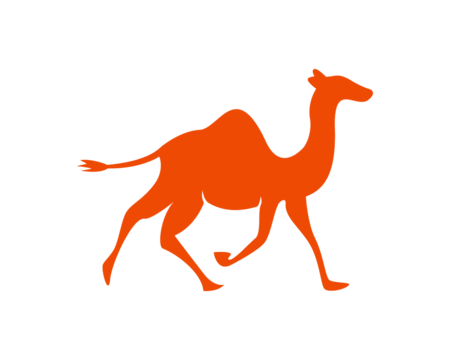

<p align="center">
  
</p>

# Qamel

This project is to introduce Qamel. A model-free reinforcement learning agent that minimizes the number of operations executed for any ```n``` node grid topology resulting in a multipartite entangled distribution.

## Project Structure

```
project_root/
│── analytical_solution/
│   │── monte_carlo.py
│   │── analytical_equations.py
│   └── utils.py
│
│── qamel/
│   │── agent.py
│   │── environment.py
│   └── utils.py
│
│── scripts/
|   │── evaluate_qamel.py
│   └── train_qamel.py
│
│── notebooks/
│   │── calculate_ratio_and_latencies.ipynb
│   └── verify_simulation.ipynb
│
│── README.md
└── .gitignore
```


### Training the Model-Free Agent
Run the following command to train the qamel agent for ```n``` nodes, ```pgen``` probability of generating entanglement and ```pswap``` probability of swapping:
```sh
python ./scripts/train_qamel.py --pgen pgen --pswap pswap --n n

```
## Accepted paper
The verified results (demonstrated in the ```verify_simulation.ipynb``` notebook) has been accepted at OFC 2025, with the paper presented as the ```OFC_paper_2025.pdf``` in the repository.

## License
This project is licensed under the MIT License. See `LICENSE` for details.
